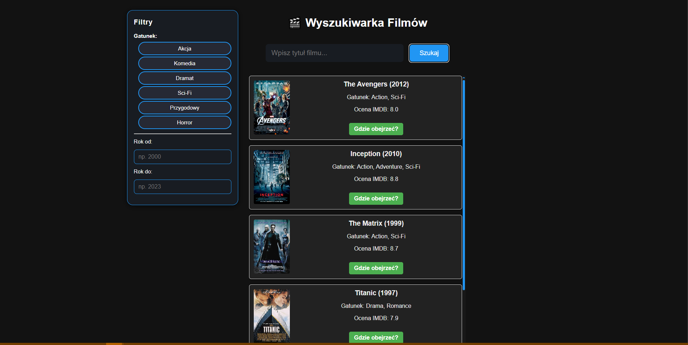

# MovieSearch

**MovieSearch** to nowoczesna wyszukiwarka filmów korzystająca z OMDb API. Pozwala na szybkie wyszukiwanie filmów, filtrowanie po gatunku, roku i ocenie IMDB, a także sprawdzenie gdzie obejrzeć film oraz wyszukanie zwiastuna na YouTube.

## Funkcje

- Wyszukiwanie filmów po tytule
- Filtry: gatunek, rok produkcji, minimalna ocena IMDB
- Przejrzysty, responsywny interfejs
- Przycisk "Gdzie obejrzeć?" (wyszukiwanie w Google)
- Przycisk "Zwiastun na YouTube"
- Podobne filmy
- Szczegóły filmu w modalu

## Jak uruchomić?

1. Sklonuj repozytorium:

git clone https://github.com/ParzY1/MovieSearch.git

2. Otwórz folder w VS Code lub innym edytorze.
3. Otwórz plik `index.html` w przeglądarce.

## Wymagania

- Przeglądarka internetowa (Chrome, Firefox, Edge, Opera)
- Połączenie z internetem (do pobierania danych z OMDb API)

## Pliki

- `index.html` – główny plik aplikacji
- `style.css` – stylowanie interfejsu
- `script.js` – logika aplikacji

## API

Aplikacja korzysta z [OMDb API](https://www.omdbapi.com/) (Open Movie Database).

## Prezentacja

## Licencja

MIT

---
